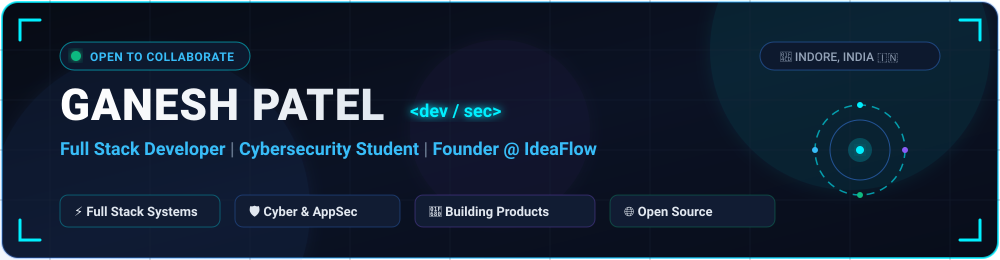

<div align="center">

  <!-- HERO BANNER -->
  

  <br/><br/>

  <!-- TYPING SVG ANIMATION -->
  <a href="https://github.com/ganeshpatel1003">
    
  </a>

  <br/>

  <!-- BADGE RIBBON -->
  <p align="center">
    <a href="https://github.com/ganeshpatel1003">
      
    </a>
    <a href="mailto:ganeshpatel1003@gmail.com">
      
    </a>
    <a href="https://github.com/ganeshpatel1003">
      
    </a>
    <a href="https://komarev.com/ghpvc/?username=ganeshpatel1003&color=00f0ff&style=for-the-badge&label=PROFILE+VIEWS">
      
    </a>
  </p>

</div>


## 🧑‍💻 About Me

```yaml
name: Ganesh Patel
role: Full Stack Software Developer & Cybersecurity Researcher
location: Indore, Madhya Pradesh, India 🇮🇳
passion: Architecting scalable web ecosystems & threat-resilient software
current_flagship: IdeaFlow (Community-Driven Product Incubation Platform)
philosophy: "Crafting pixel-perfect frontend experiences backed by bulletproof backend architecture and security-first engineering."
```

- 🚀 **Full-Stack Engineering**: Proficient in building high-concurrency, responsive full-stack applications utilizing **Next.js 15, TypeScript, React, Tailwind CSS, Node.js, and Supabase**.
- 🛡️ **Cybersecurity & Systems Defense**: Actively exploring network security, application vulnerability assessment, penetration testing fundamentals, and zero-trust authentication workflows.
- 💡 **Product Architecture & Startups**: Transforming conceptual ideas into user-tested, production-ready applications with seamless UX and high-performance databases.
- 🌐 **Open Source & Continuous Learning**: Enthusiastic contributor and believer in learning in public, code reviews, and modern CI/CD automation.

<br/>


## 🚀 Featured Flagship Projects

<table>
  <tr>
    <td width="50%" valign="top">
      <h3 align="center">💡 IdeaFlow</h3>
      <p align="center">
        <b>Next-Gen Community Product Validation & Incubation Platform</b>
      </p>
      <p align="center">
        
        
        
        
        
      </p>
      <ul>
        <li><b>Community Consensus Engine:</b> Allows innovators to pitch concepts and validate market demand through real-time voting & algorithmic feedback.</li>
        <li><b>Roadmap & Traction Tracking:</b> Dynamic milestone tracker for founders to broadcast progress from MVP to public launch.</li>
        <li><b>Collaborator Matching:</b> Seamlessly connects ideators with full-stack developers, designers, and early adopters.</li>
        <li><b>Security & RLS:</b> Built with Supabase Row Level Security (RLS) and JWT auth guards.</li>
      </ul>
      <p align="center">
        <a href="https://github.com/ganeshpatel1003"><b>📁 Explore Repository →</b></a>
      </p>
    </td>
    <td width="50%" valign="top">
      <h3 align="center">🧺 Indore Fresh Basket</h3>
      <p align="center">
        <b>Hyper-Localized Farm-to-Fork Organic E-Commerce Platform</b>
      </p>
      <p align="center">
        
        
        
        
        
      </p>
      <ul>
        <li><b>Direct Kisan Mitra Network:</b> Connects certified organic farmers in Malwa clusters (Depalpur, Sanwer, Rau) directly with urban families.</li>
        <li><b>Batch Provenance Traceability:</b> Real-time harvest origin badges with zero chemical residue lab verification badges.</li>
        <li><b>Full-Suite Portals:</b> Dedicated Consumer Marketplace, Farmer Inventory Portal, and Super Admin Revenue Dispatcher.</li>
        <li><b>Payment Integration:</b> Native Razorpay checkout handler + Instant UPI QR code simulation engine.</li>
      </ul>
      <p align="center">
        <a href="https://github.com/ganeshpatel1003/1st-PROJECT"><b>📁 Explore Repository →</b></a>
      </p>
    </td>
  </tr>
</table>

<br/>


## 🛠️ Technical Arsenal & Skills Matrix

<div align="center">

### 💻 Frontend Architecture & UI
<p>
  
  
  
  
  
  
  
  
</p>

### ⚙️ Backend Systems, Cloud & Databases
<p>
  
  
  
  
  
  
  
</p>

### 🛡️ Cybersecurity, DevSecOps & Tools
<p>
  
  
  
  
  
  
  
  
</p>

</div>

<br/>


## 📊 Live GitHub Analytics & Performance

<div align="center">

  <table border="0" width="100%">
    <tr align="center">
      <td>
        
      </td>
      <td>
        
      </td>
    </tr>
  </table>

  <br/>

  <!-- STREAK STATS -->
  

  <br/><br/>

  <!-- ACTIVITY GRAPH -->
  

</div>

<br/>

<!-- CONTRIBUTION SNAKE ANIMATION -->
<div align="center">
  <h3>🐍 Contribution Graph Journey</h3>
  <picture>
    <source media="(prefers-color-scheme: dark)" srcset="https://raw.githubusercontent.com/ganeshpatel1003/ganeshpatel1003/output/github-contribution-grid-snake-dark.svg">
    <source media="(prefers-color-scheme: light)" srcset="https://raw.githubusercontent.com/ganeshpatel1003/ganeshpatel1003/output/github-contribution-grid-snake.svg">
    
  </picture>
</div>

<br/>


## 🤝 Let's Connect & Collaborate

<div align="center">

  <p>Whether you want to discuss full-stack product development, cybersecurity, discuss startup ideas on <b>IdeaFlow</b>, or explore collaboration opportunities — feel free to reach out!</p>

  <p align="center">
    <a href="https://www.linkedin.com/in/ganeshpatel1003/" target="_blank">
      
    </a>
    <a href="mailto:ganeshpatel1003@gmail.com">
      
    </a>
    <a href="https://github.com/ganeshpatel1003" target="_blank">
      
    </a>
    <a href="https://portfolio-ganeshpatel.vercel.app" target="_blank">
      
    </a>
  </p>

</div>

<br/>

<div align="center">
  <sub>⚡ Engineered with passion by <b><a href="https://github.com/ganeshpatel1003">Ganesh Patel</a></b> | © 2026 All Rights Reserved</sub>
</div>
